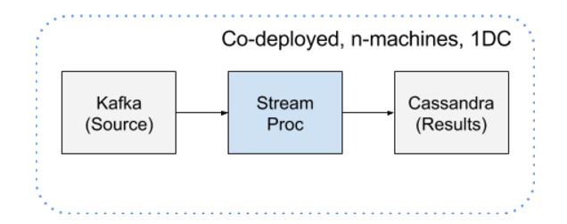

# Liberty Demo

The liberty demo is a stream processor benchmark. This benchmark contains a variety
of different tests all which use the
[liberty data set](https://web.archive.org/web/20130604233714/http://www.cs.sandia.gov/~jrstear/logs/)
as demo data. The dataset was pre-loaded into a single topic of Kafka with 144 partitions. Then,
a stream processor would consume the data from Kafka and write to Cassandra using their
preferred/”best choice” API. All processing was performed within the stream processor.

This benchmark is a work in progress. At the moment
we have completed designing and recording results for the [Concord](http://concord.io) and
the [Apache Spark](http://spark.apache.org) Streaming Frameworks. A blog post of the results
will be linked to this README in the near future.

## Single Message Tests

#### Deduplication (dedup)

Consume Topic 1 and publish a de-duplicated, time-stamp ordered version to Kafka. De-duplicate based on the entire message

#### Pattern Matching (match)

Consume Topic 1 and write a unique key to Cassandra for each message containing the string ‘IRQ’. The value should contain:
- Current timestamp in ISO-8601 format
- Message timestamp converted to ISO-8601 format
- username associated with the event (if any, e.g. src@ladmin)
- node name (e.g. src@ladmin)
- The line’s log payload

#### Counting Events (count)

Consume Topic 1 and count all unique space-delimited strings, grouped by month and year

## Windowed Tests

#### Pattern Matching inside Time Window (time_count)

- Window Width: 10s
- Window Slide: 10s
- Perform Single Event Pattern Matching Test 1 for each window, writing a unique result set for each window

#### Count Events inside Time Window (time_match)

- Window Width: 10s
- Window Slide: 1s
- Perform Single Event Counting Test 1 for each window, writing a unique result set for each window

#### Pattern Matching inside Count Window (bucket_match)

- Window Width: 100,000 messages
- Window Slide: 100,000 messages
- Perform Single Event Pattern Matching Test 1 for each window, writing a unique result set for each window

#### Count Events inside Count Window (bucket_count)

- Window Width: 1,000,000 messages
- Window Slide: 100,000 messages
- Perform Single Event Counting Test 1 for each window, writing a unique result set for each window
